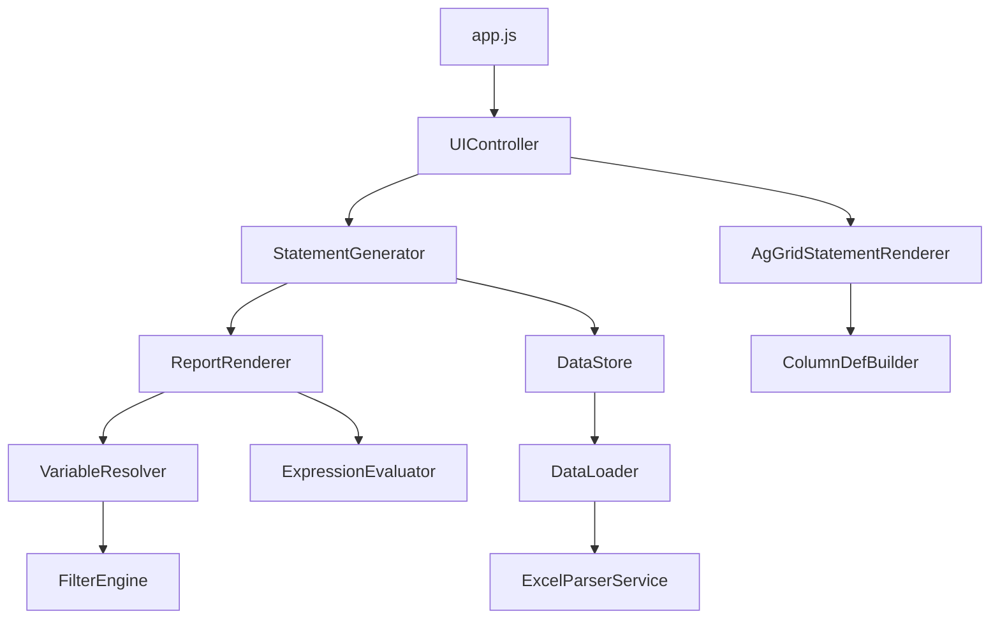

# Architecture Overview

Technical architecture and design of the Financial Statement Generator.

## Table of Contents

1. [System Overview](#system-overview)
2. [Technology Stack](#technology-stack)
3. [Module Structure](#module-structure)
4. [Data Flow](#data-flow)
5. [Core Components](#core-components)
6. [Report System](#report-system)
7. [Error System](#error-system)
8. [Testing Architecture](#testing-architecture)

## System Overview

The Financial Statement Generator is a client-side web application that transforms trial balance data into professional financial statements. The architecture follows a modular design with clear separation of concerns.

### Key Architectural Principles

1. **Client-Side Processing**: All data processing happens in the browser
2. **Modular Design**: Clear separation between data, business logic, and UI
3. **Configuration-Driven**: Reports defined via JSON, not hardcoded
4. **Type Safety**: Gradual migration to TypeScript for better maintainability
5. **Performance First**: Optimized for large datasets (5,000+ accounts)

### Architecture Pattern

```
┌─────────────────────────────────────────────────────────────┐
│                         Browser                              │
│  ┌────────────────────────────────────────────────────────┐ │
│  │                    UI Layer (HTML/CSS)                  │ │
│  │              UIController, AgGridRenderer               │ │
│  └────────────────────────────────────────────────────────┘ │
│                            ↕                                 │
│  ┌────────────────────────────────────────────────────────┐ │
│  │              Business Logic Layer (JS/TS)               │ │
│  │    StatementGenerator, ReportRenderer, Calculators     │ │
│  └────────────────────────────────────────────────────────┘ │
│                            ↕                                 │
│  ┌────────────────────────────────────────────────────────┐ │
│  │                Data Layer (Arquero)                     │ │
│  │         DataStore, DataLoader, DataProcessor           │ │
│  └────────────────────────────────────────────────────────┘ │
│                            ↕                                 │
│  ┌────────────────────────────────────────────────────────┐ │
│  │              File System Access API                     │ │
│  │                  (Excel Files)                          │ │
│  └────────────────────────────────────────────────────────┘ │
└─────────────────────────────────────────────────────────────┘
```

## Technology Stack

### Core Technologies

- **JavaScript (ES6+)**: Main application language
- **TypeScript**: Gradual migration for type safety
- **HTML5/CSS3**: Modern web standards
- **Deno**: Test runtime with native TypeScript support

### Key Libraries

- **ag-Grid Community (v31.0.3)**: Professional data grid
  - Fast rendering of large datasets
  - Built-in sorting, filtering, export
  - Column resizing and customization

- **Arquero (v5.4.1)**: Data manipulation
  - DataFrame-based data processing
  - SQL-like operations
  - Efficient aggregations and transformations

- **ExcelJS (v4.4.0)**: Excel file parsing
  - Read .xlsx files
  - Extract worksheets and cell data
  - Handle various Excel formats

### Development Tools

- **Deno**: Test runner and TypeScript runtime
- **TypeScript Compiler**: Type checking
- **Standard Library**: Testing utilities

## Module Structure

```
src/
├── app.js                      # Application entry point
├── data/                       # Data management layer
│   ├── DataLoader.js          # Excel file loading
│   ├── DataStore.js           # Centralized data storage
│   └── DataProcessor.js       # Data transformation
├── utils/                      # Utility modules (TypeScript)
│   ├── DateUtils.ts           # Date manipulation
│   ├── HierarchyBuilder.ts    # Account hierarchy
│   ├── CategoryMatcher.ts     # Account categorization
│   ├── VarianceCalculator.ts  # Variance calculations
│   ├── LTMCalculator.ts       # LTM period calculations
│   ├── ValidationResult.ts    # Validation utilities
│   └── Logger.ts              # Logging utility
├── services/                   # Service layer (TypeScript)
│   ├── FileSelectionService.ts    # File selection
│   ├── StatusMessageService.ts    # Status messages
│   ├── FileMetricsService.ts      # File metrics
│   └── ValidationService.ts       # Validation
├── errors/                     # Error system (TypeScript)
│   ├── ApplicationError.ts    # Base error class
│   ├── DataLoadError.ts       # Data loading errors
│   ├── ValidationError.ts     # Validation errors
│   ├── ReportGenerationError.ts   # Report errors
│   ├── NetworkError.ts        # Network errors
│   ├── ConfigurationError.ts  # Config errors
│   ├── ErrorFactory.ts        # Error creation
│   ├── ErrorGuards.ts         # Type guards
│   ├── ErrorMetrics.ts        # Error tracking
│   └── ErrorCodes.ts          # Error code constants
├── reports/                    # Configurable report system
│   ├── ReportLoader.js        # Load JSON definitions
│   ├── ReportRegistry.js      # Manage available reports
│   ├── ReportValidator.js     # Validate definitions
│   ├── ReportRenderer.js      # Generate statements
│   ├── ExpressionEvaluator.js # Calculate expressions
│   ├── VariableResolver.js    # Resolve variables
│   └── FilterEngine.js        # Apply data filters
├── statements/                 # Statement generation
│   └── StatementGenerator.js  # Main generator
├── export/                     # Export functionality
│   └── CSVExporter.js         # CSV export
└── ui/                         # UI components
    ├── UIController.js        # Main UI controller
    ├── AgGridStatementRenderer.js  # Grid rendering
    └── ColumnDefBuilder.js    # Column definitions
```

### Module Dependencies



## Data Flow

### 1. Data Loading Flow

```
User Selects Directory
        ↓
File System Access API
        ↓
DataLoader reads Excel files
        ↓
ExcelParserService parses sheets
        ↓
DataProcessor transforms to Arquero tables
        ↓
DataStore stores in memory
        ↓
UI updates with available data
```

### 2. Statement Generation Flow

```
User selects statement type + periods
        ↓
UIController calls StatementGenerator
        ↓
ReportRegistry provides report definition
        ↓
ReportRenderer processes definition:
  - VariableResolver filters & aggregates data
  - ExpressionEvaluator calculates metrics
  - Apply formatting rules
        ↓
VarianceCalculator adds comparisons
        ↓
AgGridStatementRenderer displays in grid
        ↓
User can export to CSV
```

### 3. Report Definition Flow

```
JSON file in /reports/ directory
        ↓
ReportLoader loads and caches
        ↓
ReportValidator validates structure
        ↓
ReportRegistry registers definition
        ↓
Available in UI dropdown
        ↓
Used by ReportRenderer for generation
```

## Core Components

### DataStore (Singleton)

**Purpose**: Centralized storage for all application data

**Key Features**:
- Singleton pattern for global access
- Stores Arquero DataFrames
- Separate storage for movements and balances
- Multi-year support (2024, 2025)

**API**:
```javascript
DataStore.setFactTable(type, year, table)
DataStore.getFactTable(type, year)
DataStore.getMovementsTable(year)
DataStore.getBalancesTable(year)
DataStore.clear()
```

### StatementGenerator

**Purpose**: Generate financial statements from data and report definitions

**Key Methods**:
```javascript
generateStatementFromDefinition(reportDef, options)
generateBalanceSheet(options)
generateIncomeStatement(options)
generateCashFlowStatement(options)
```

**Options**:
- `year`: Target year (2024, 2025)
- `period`: Period selection (All, P1-P12, Q1-Q4, LTM)
- `comparisonYear`: Year to compare against
- `comparisonPeriod`: Period to compare against
- `varianceMode`: How to show variance (Amount, Percent, Both, None)

### ReportRenderer

**Purpose**: Process report definitions and generate statement data

**Process**:
1. Load report definition
2. Resolve all variables (filter + aggregate)
3. Sort layout items by order
4. Process each layout item:
   - Variable: Get from resolved variables
   - Calculated: Evaluate expression
   - Category: Filter and aggregate directly
   - Subtotal: Sum range of items
   - Spacer: Empty row
5. Calculate variances
6. Apply formatting
7. Return statement data

### AgGridStatementRenderer

**Purpose**: Render statements in ag-Grid

**Features**:
- Dynamic column generation
- Row styling based on item type
- Indentation support
- Number formatting
- Export to CSV

## Report System

### Report Definition Structure

```json
{
  "reportId": "unique_id",
  "name": "Display Name",
  "version": "1.0.0",
  "statementType": "income|balance|cashflow",
  
  "variables": {
    "var_name": {
      "filter": { "code1": "700" },
      "aggregate": "sum"
    }
  },
  
  "layout": [
    {
      "order": 10,
      "label": "Revenue",
      "type": "variable",
      "variable": "var_name",
      "format": "currency",
      "style": "normal",
      "indent": 0
    }
  ],
  
  "formatting": {
    "currency": {
      "decimals": 0,
      "thousands": true,
      "symbol": "€"
    }
  }
}
```

### Expression Language

Simple arithmetic expressions with variables:

```javascript
// Basic arithmetic
"revenue + cogs"
"revenue * 0.21"

// Order references
"@10 + @20"  // Sum of items at order 10 and 20

// Parentheses
"(revenue + cogs) * 0.5"

// Unary minus
"-1 * expenses"
```

### Filter Specifications

```javascript
// Exact match
{ "code1": "700" }

// Multiple values (OR)
{ "code1": ["700", "710", "720"] }

// Multiple fields (AND)
{ "code1": "700", "statement_type": "Winst & verlies" }

// Pattern matching
{ "name1": { "contains": "omzet" } }
```

## Error System

### Error Hierarchy

The application uses a comprehensive error system with specialized error types:

```
ApplicationError (base class)
├── DataLoadError
│   ├── FileNotFoundError
│   ├── FileParseError
│   └── InvalidDataError
├── ValidationError
│   ├── MissingFieldError
│   ├── InvalidFormatError
│   └── ValidationFailedError
├── ReportGenerationError
│   ├── TemplateError
│   ├── RenderError
│   └── ExpressionError
├── NetworkError
│   ├── TimeoutError
│   ├── ConnectionError
│   └── ResponseError
└── ConfigurationError
    ├── MissingConfigError
    ├── InvalidConfigError
    └── ConfigLoadError
```

### Error Components

**ApplicationError** (`src/errors/ApplicationError.ts`):
- Base class for all application errors
- Includes error code, user message, context, and cause
- Supports error chaining and stack traces
- Provides structured error information

**ErrorFactory** (`src/errors/ErrorFactory.ts`):
- Factory methods for creating specific error types
- Consistent error creation across the application
- Automatic error wrapping and context addition
- Type-safe error construction

**ErrorGuards** (`src/errors/ErrorGuards.ts`):
- Type guards for error identification
- Check if error is specific type
- Extract error information safely
- Enable type-safe error handling

**ErrorMetrics** (`src/errors/ErrorMetrics.ts`):
- Track error occurrences
- Analyze error patterns
- Generate error reports
- Monitor application health

### Error Handling Pattern

```typescript
try {
    // Operation that might fail
    const data = await loadData();
} catch (error) {
    // Wrap and enrich error
    throw ErrorFactory.wrap(error, {
        operation: 'loadData',
        context: { filename: 'data.xlsx' }
    });
}
```

### Error Context

Errors include rich context information:
- **code**: Machine-readable error code
- **userMessage**: User-friendly error message
- **context**: Additional context (operation, parameters, state)
- **cause**: Original error that caused this error
- **timestamp**: When the error occurred
- **stack**: Stack trace for debugging

### Testing

- 177 comprehensive unit tests
- 100% coverage of error system
- Tests for all error types and scenarios
- Property-based tests for error handling

## Testing Architecture

### Test Structure

```
test/
├── unit/                       # Unit tests
│   ├── data/                  # Data layer tests
│   ├── utils/                 # Utility tests
│   ├── reports/               # Report system tests
│   ├── statements/            # Statement generation tests
│   └── ui/                    # UI component tests
├── integration/                # Integration tests
│   ├── StatementGenerator.integration.test.ts
│   └── UIController.integration.test.ts
└── performance/                # Performance tests
    └── configurable-reports-performance.test.ts
```

### Test Categories

**Unit Tests** (273+ tests):
- Test individual functions and classes
- Mock external dependencies
- Fast execution (< 1ms per test)
- Comprehensive coverage including:
  - Error system: 177 tests (100% coverage)
  - Core utilities and services
  - Report system components

**Property-Based Tests**:
- Test universal properties
- Generate random inputs
- Verify invariants hold
- Examples:
  - Expression evaluation determinism
  - Filter application correctness
  - Subtotal calculation accuracy

**Integration Tests**:
- Test component interactions
- Use real data and definitions
- Verify end-to-end workflows

**Performance Tests**:
- Measure execution time
- Test with large datasets
- Verify performance requirements

### Running Tests

```bash
# All unit tests
deno test --allow-read --allow-write test/unit/

# With coverage
deno test --allow-read --allow-write --coverage=coverage test/unit/
deno coverage coverage

# Watch mode
deno test --allow-read --allow-write --watch test/unit/

# Specific test file
deno test --allow-read --allow-write test/unit/reports/ReportLoader.test.ts
```

## Performance Considerations

### Optimization Strategies

1. **Data Caching**:
   - Report definitions cached after first load
   - Variable calculations cached per period
   - Arquero tables reused across operations

2. **Lazy Evaluation**:
   - Arquero operations are lazy until materialized
   - Only process visible data in grid
   - Defer expensive calculations

3. **Efficient Data Structures**:
   - Arquero DataFrames for columnar operations
   - Map-based lookups for O(1) access
   - Minimal data copying

4. **Grid Optimization**:
   - ag-Grid's virtual scrolling
   - Row virtualization for large datasets
   - Efficient cell rendering

### Performance Targets

- **Data Loading**: < 3 seconds for 5,000 accounts
- **Statement Generation**: < 2 seconds
- **Grid Rendering**: < 1 second
- **Export**: < 3 seconds
- **Memory Usage**: < 200MB for typical datasets

## Security Considerations

### Client-Side Security

1. **No Server Communication**: All processing local
2. **File System Access**: User must explicitly grant permission
3. **Data Privacy**: No data leaves the browser
4. **Input Validation**: All user inputs validated
5. **XSS Prevention**: Sanitize all displayed content

### Data Validation

- Excel file format validation
- Report definition schema validation
- Expression syntax validation
- Account hierarchy validation
- Balance verification

## Browser Compatibility

### Required Features

- **File System Access API**: Chrome 86+, Edge 86+, Opera 72+
- **ES6 Modules**: All modern browsers
- **Fetch API**: All modern browsers
- **Local Storage**: All modern browsers

### Not Supported

- ❌ Firefox (no File System Access API)
- ❌ Safari (no File System Access API)
- ❌ Internet Explorer (deprecated)

## Future Enhancements

### Planned Features

1. **Web Workers**: Background processing for large datasets
2. **IndexedDB**: Persistent local storage
3. **Service Workers**: Offline functionality
4. **WebAssembly**: Performance-critical calculations
5. **PDF Export**: Direct PDF generation
6. **Chart Visualization**: Interactive charts

### Scalability

- **Streaming Processing**: Handle very large files
- **Progressive Loading**: Load data incrementally
- **Multi-threading**: Parallel processing
- **Cloud Integration**: Optional cloud storage

## Troubleshooting

### Common Issues

**Performance Issues**:
- Check dataset size (> 10,000 accounts may be slow)
- Clear browser cache
- Close other browser tabs
- Use Chrome for best performance

**Memory Issues**:
- Reduce period range
- Clear DataStore between operations
- Reload page to free memory

**Grid Issues**:
- Check browser console for errors
- Verify ag-Grid license (Community Edition)
- Update browser to latest version

### Debug Mode

Enable debug logging:
```javascript
window.DEBUG = true;
```

Check console for:
- Data loading progress
- Statement generation steps
- Error messages with stack traces
- Performance timing information
